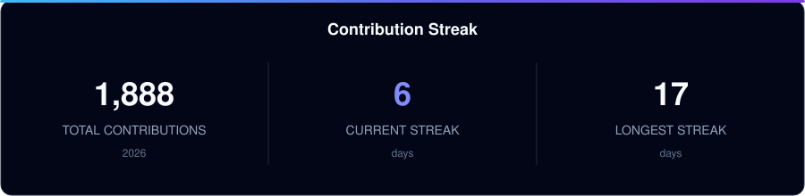

# RASHAD OMRAN

### SOFTWARE ENGINEER × CYBERSECURITY

 

&nbsp;

 

---

## `01 // ABOUT`

Software engineer building across **web, mobile, and backend systems**.

I enjoy the parts beyond the interface — architecture, APIs, data, deployment, and the decisions that keep software reliable as it grows.

Currently pursuing a **Master's in Cybersecurity**, bringing security closer to the way I design and build systems.

 

---

## `02 // ENGINEERING TOOLKIT`

 

---

## `03 // ENGINEERING ACTIVITY`

### Contribution Activity

 

### Contribution Streak

 

### Language Distribution

 

---

## `04 // SELECTED SYSTEMS`

<table>
<tr>

<td width="33%" valign="top">

### `01` OneStore

Commerce platform covering products, inventory, storefront ordering and point-of-sale workflows.

 

`Node.js` `PostgreSQL` `React`

</td>

<td width="33%" valign="top">

### `02` Seen

Multi-channel social media management built around communication, publishing and automation.

 

`Node.js` `React` `Meta APIs`

</td>

<td width="33%" valign="top">

### `03` MindEase

Web and mobile platform for remote sessions, assessments and digital services.

 

`React Native` `Node.js` `Python`

</td>

</tr>
</table>

 

---

## `05 // CURRENT FOCUS`

<table>
<tr>

<td align="center" width="25%">

### BUILD

Software Engineering

`Web` `Mobile`

</td>

<td align="center" width="25%">

### ENGINEER

Backend Systems

`APIs` `Data`

</td>

<td align="center" width="25%">

### DESIGN

Architecture

`Systems` `Infra`

</td>

<td align="center" width="25%">

### SECURE

Cybersecurity

`MSc` `AppSec`

</td>

</tr>
</table>

 

### `BUILD → ENGINEER → DESIGN → SECURE`

 

---

## `06 // OPEN CHANNEL`

### Have a problem worth solving?

Good software starts with understanding the problem — not choosing the framework.

 

&nbsp;

  

Software Engineering · Systems · Cybersecurity

